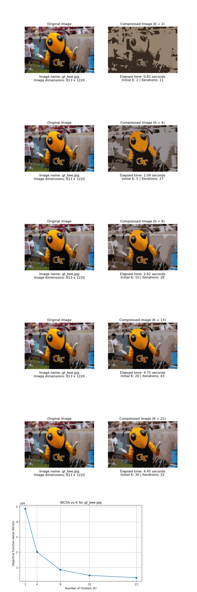
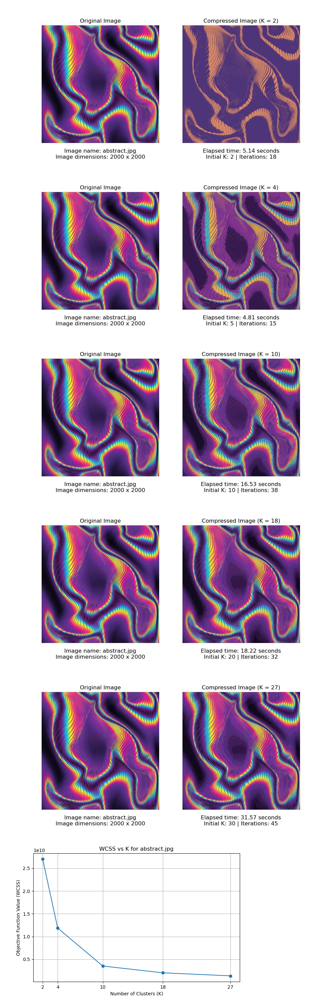
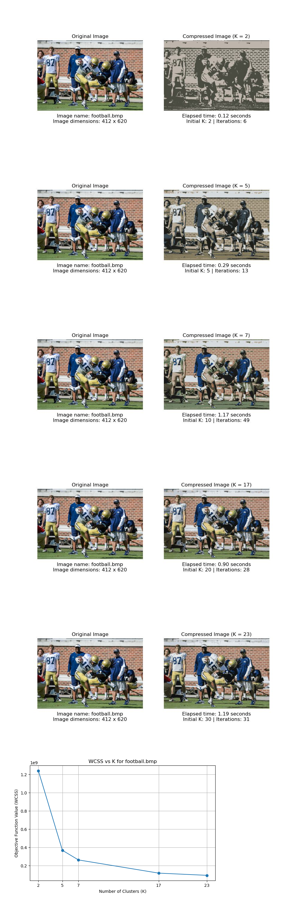
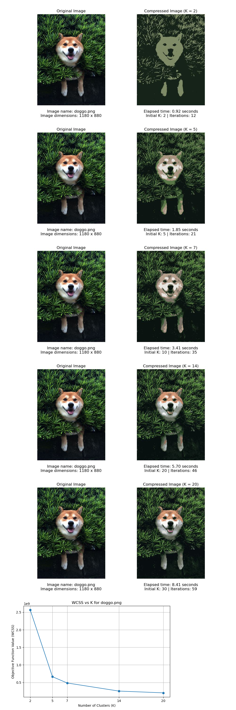
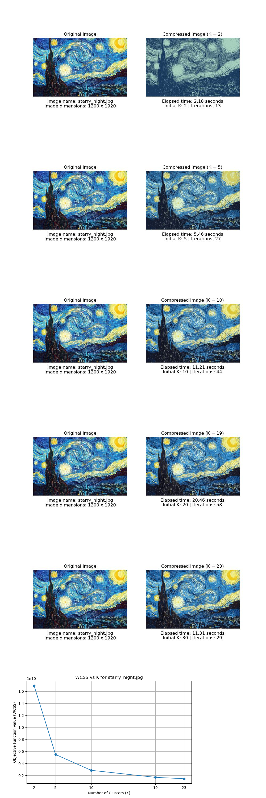
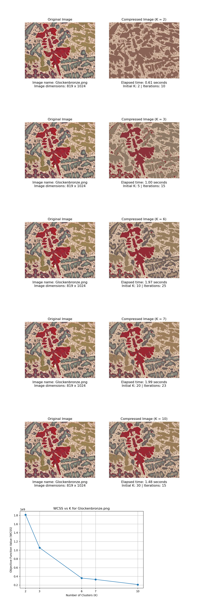

# K-Means-Algorithm-from-Scratch

This repo contains my code to run K-Means clustering algorithm from scratch. The algorithm takes in image data as input and tries to cluster the color assingment using K = 2, 5, 10, 20, and 30. The euclidean distance equation (l-2 norm) objective function isbeing used to calculate clusters and find optimal centroids. The results including the number of itterations and elapsed time for various images of different colors and sizes are shown below.

|  |  |
|  |  |
|  |  |

